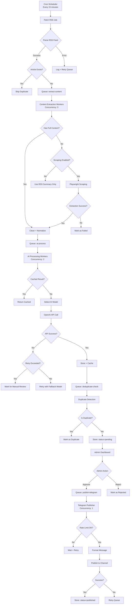
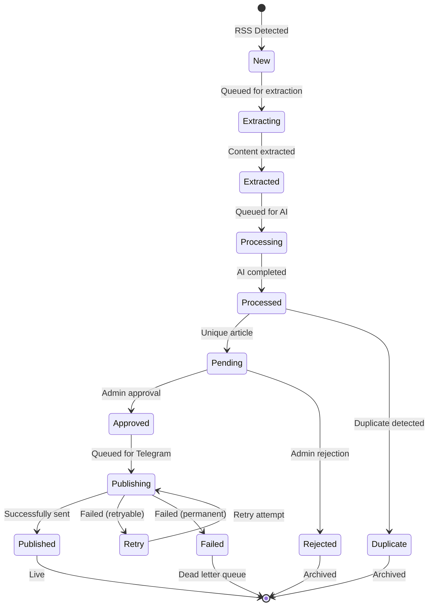
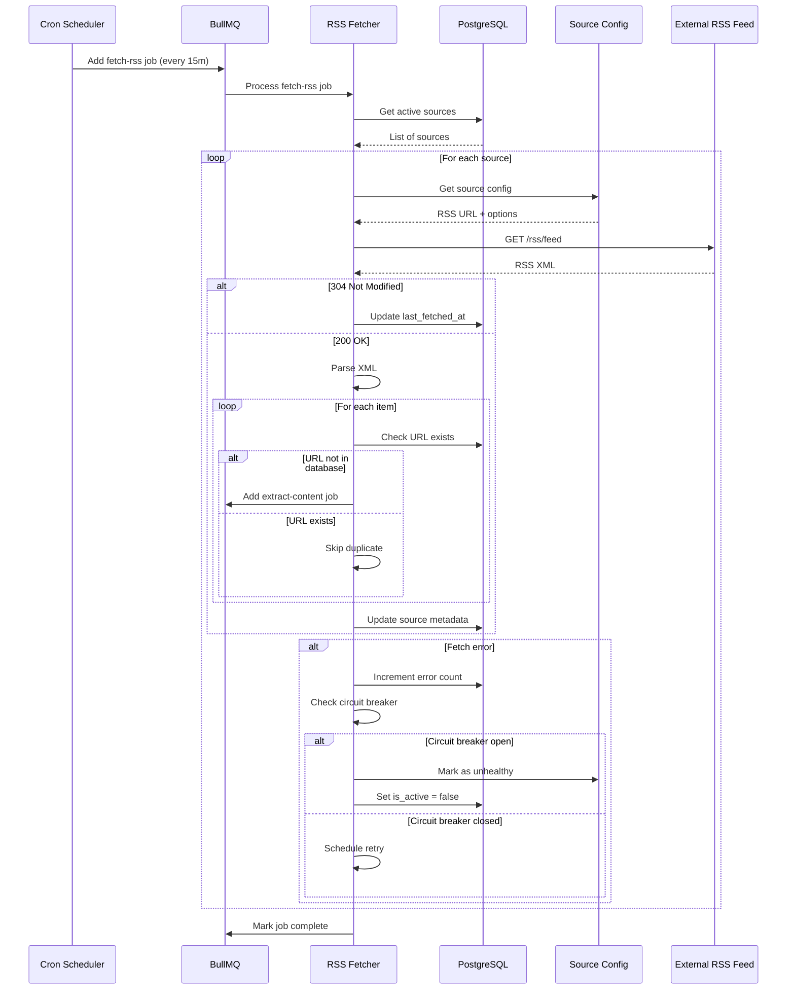
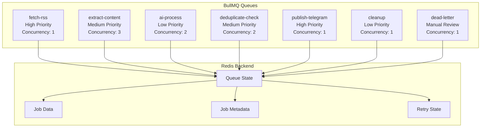
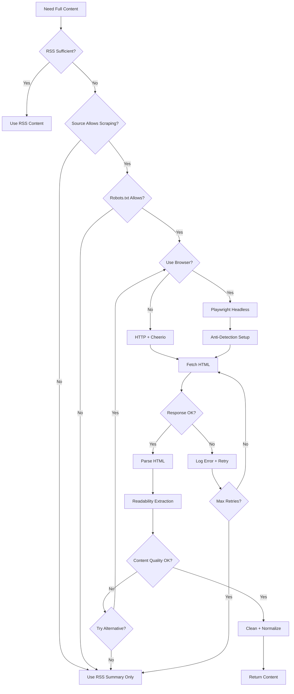
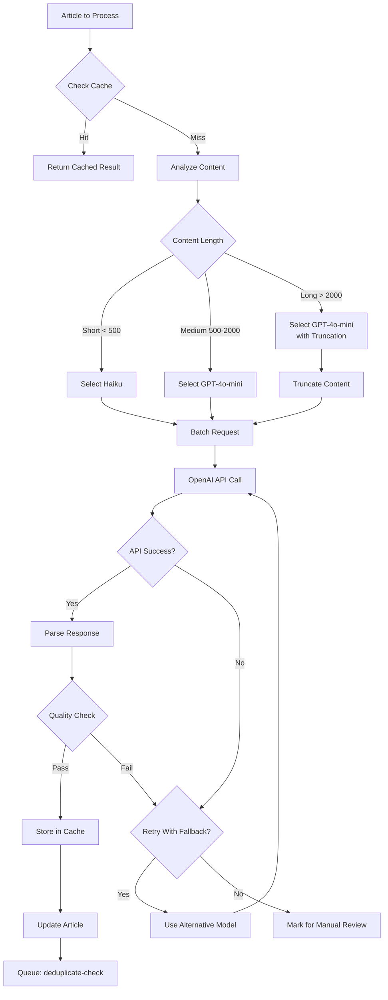
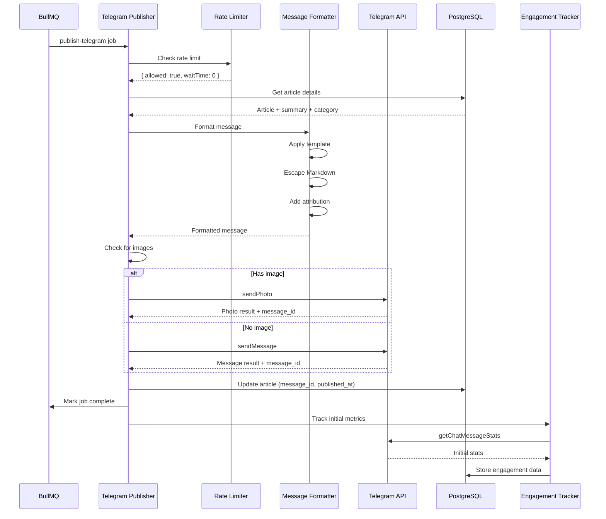
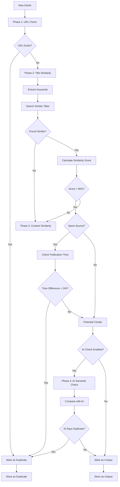
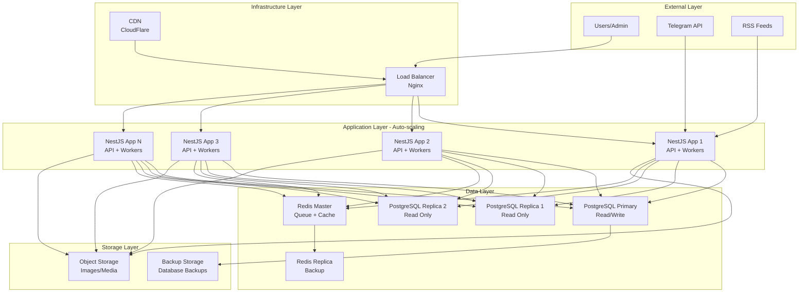

# architecture.md

## System Architecture

### Overview

The AI News Intelligence Platform is a monolithic NestJS application designed for production deployment on a single VPS using Docker Compose. The architecture prioritizes simplicity, cost-efficiency, and reliability while maintaining the ability to scale horizontally as needed.

```
┌─────────────────────────────────────────────────────────────────┐
│                    Production VPS (4 CPU, 8GB RAM)               │
│                                                                  │
│  ┌──────────────┐  ┌──────────────┐  ┌──────────────────────┐  │
│  │    Nginx     │  │  Next.js     │  │     NestJS App       │  │
│  │  (Reverse    │──│   Admin      │  │   (API + Workers)    │  │
│  │   Proxy)     │  │  Dashboard   │  │                      │  │
│  │  Port: 80/443│  │  Port: 3001  │  │  Port: 3000          │  │
│  └──────────────┘  └──────────────┘  └──────────┬───────────┘  │
│                                                │                 │
│  ┌─────────────────────────────────────────────┴─────────────┐  │
│  │                   Docker Network (bridge)                 │  │
│  │                                                          │  │
│  │  ┌──────────────┐  ┌──────────────┐  ┌──────────────┐  │  │
│  │  │  PostgreSQL  │  │    Redis     │  │  BullMQ UI   │  │  │
│  │  │  Port: 5432  │  │  Port: 6379  │  │  Port: 3002  │  │  │
│  │  │   (Data)     │  │  (Queues)    │  │  (Monitoring)│  │  │
│  │  └──────────────┘  └──────────────┘  └──────────────┘  │  │
│  └──────────────────────────────────────────────────────────┘  │
└─────────────────────────────────────────────────────────────────┘
                            │
                            │ HTTPS
                            ▼
                   ┌──────────────┐
                   │   Telegram   │
                   │  API + Bot   │
                   └──────────────┘
```

**Architectural Principles:**
1. **Monolith First**: Single NestJS application reduces operational complexity and deployment overhead
2. **Queue-Driven**: BullMQ with Redis provides reliable async processing and job persistence
3. **RSS-First**: Prioritize RSS feeds over scraping for legal compliance and efficiency
4. **AI-Cost Optimized**: Smart caching, model routing, and batching minimize AI expenses
5. **Horizontal Scaling Ready**: Application can scale by adding more worker instances

---

## Data Flow Architecture

### End-to-End Pipeline



### State Transitions



---

## Module Architecture

### NestJS Module Structure

```
src/
├── main.ts                          # Application bootstrap
├── app.module.ts                    # Root module
│
├── core/                            # Core infrastructure
│   ├── config/                      # Configuration management
│   │   ├── config.module.ts
│   │   ├── app.config.ts
│   │   └── database.config.ts
│   │
│   ├── database/                    # Database providers
│   │   ├── database.module.ts
│   │   └── prisma.service.ts
│   │
│   ├── queue/                       # Queue management
│   │   ├── queue.module.ts
│   │   └── bullmq.service.ts
│   │
│   ├── logger/                      # Logging infrastructure
│   │   ├── logger.module.ts
│   │   └── pino.logger.ts
│   │
│   └── cache/                       # Caching layer
│       ├── cache.module.ts
│       └── redis-cache.service.ts
│
├── ingestion/                       # Data ingestion layer
│   ├── rss/                         # RSS feed processing
│   │   ├── rss.module.ts
│   │   ├── rss-fetcher.service.ts
│   │   ├── rss-parser.service.ts
│   │   └── dto/
│   │
│   ├── scraping/                    # HTML scraping fallback
│   │   ├── scraping.module.ts
│   │   ├── playwright.service.ts
│   │   ├── readability.service.ts
│   │   └── anti-detection.service.ts
│   │
│   ├── sources/                     # Source management
│   │   ├── sources.module.ts
│   │   ├── sources.service.ts
│   │   ├── sources.controller.ts
│   │   └── entities/
│   │
│   └── extractors/                  # Content extraction
│       ├── extractors.module.ts
│       ├── content-extractor.service.ts
│       ├── metadata-extractor.service.ts
│       └── content-cleaner.service.ts
│
├── processing/                      # AI processing layer
│   ├── ai/                          # AI service integration
│   │   ├── ai.module.ts
│   │   ├── ai.service.ts
│   │   ├── openai.service.ts
│   │   ├── claude.service.ts
│   │   ├── model-router.service.ts
│   │   ├── ai-cache.service.ts
│   │   └── token-tracker.service.ts
│   │
│   ├── deduplication/               # Duplicate detection
│   │   ├── deduplication.module.ts
│   │   ├── deduplication.service.ts
│   │   ├── url-deduplicator.service.ts
│   │   ├── title-deduplicator.service.ts
│   │   └── content-deduplicator.service.ts
│   │
│   ├── classification/               # Content classification
│   │   ├── classification.module.ts
│   │   ├── classification.service.ts
│   │   ├── category-classifier.service.ts
│   │   └── sentiment-analyzer.service.ts
│   │
│   └── summarization/               # Text summarization
│       ├── summarization.module.ts
│       ├── summarization.service.ts
│       ├── title-rewriter.service.ts
│       └── summary-validator.service.ts
│
├── publishing/                      # Publishing layer
│   ├── telegram/                    # Telegram integration
│   │   ├── telegram.module.ts
│   │   ├── telegram.service.ts
│   │   ├── telegram-bot.service.ts
│   │   ├── message-formatter.service.ts
│   │   ├── rate-limiter.service.ts
│   │   └── scheduler.service.ts
│   │
│   ├── templates/                   # Message templates
│   │   ├── templates.module.ts
│   │   ├── template-engine.service.ts
│   │   └── templates/
│   │
│   └── engagement/                  # Engagement tracking
│       ├── engagement.module.ts
│       ├── engagement-tracker.service.ts
│       └── metrics-collector.service.ts
│
├── moderation/                      # Content moderation
│   ├── approval/                    # Manual approval workflow
│   │   ├── approval.module.ts
│   │   ├── approval.service.ts
│   │   ├── approval-queue.service.ts
│   │   └── approval.controller.ts
│   │
│   ├── auto-moderation/             # Automated moderation
│   │   ├── auto-moderation.module.ts
│   │   ├── keyword-filter.service.ts
│   │   ├── quality-scanner.service.ts
│   │   └── spam-detector.service.ts
│   │
│   └── audit/                       # Audit logging
│       ├── audit.module.ts
│       ├── audit.service.ts
│       └── audit-log.service.ts
│
├── analytics/                       # Analytics & monitoring
│   ├── metrics/                     # Metrics collection
│   │   ├── metrics.module.ts
│   │   ├── metrics.service.ts
│   │   └── metrics-collector.service.ts
│   │
│   ├── trends/                      # Trending analysis
│   │   ├── trends.module.ts
│   │   ├── trends.service.ts
│   │   ├── keyword-tracker.service.ts
│   │   └── topic-detector.service.ts
│   │
│   └── reports/                     # Reporting
│       ├── reports.module.ts
│       ├── reports.service.ts
│       └── report-generator.service.ts
│
├── queue/                           # Queue processors
│   ├── processors/
│   │   ├── fetch-rss.processor.ts
│   │   ├── extract-content.processor.ts
│   │   ├── ai-process.processor.ts
│   │   ├── deduplicate.processor.ts
│   │   ├── publish-telegram.processor.ts
│   │   └── cleanup.processor.ts
│   │
│   └── queue.module.ts
│
├── admin/                           # Admin API
│   ├── admin.module.ts
│   ├── admin.controller.ts
│   ├── admin.service.ts
│   ├── auth/                        # Authentication
│   │   ├── auth.module.ts
│   │   ├── api-key.guard.ts
│   │   └── api-key.service.ts
│   │
│   └── dashboard/                   # Dashboard endpoints
│       ├── dashboard.controller.ts
│       └── dashboard.service.ts
│
├── common/                          # Shared utilities
│   ├── decorators/                  # Custom decorators
│   ├── filters/                     # Exception filters
│   ├── guards/                      # Route guards
│   ├── interceptors/                # Interceptors
│   ├── pipes/                       # Custom pipes
│   ├── utils/                       # Utility functions
│   └── constants/                   # Application constants
│
└── health/                          # Health checks
    ├── health.module.ts
    └── health.controller.ts
```

---

## RSS Ingestion Pipeline

### RSS Fetching Architecture



### RSS Fetching Configuration

```typescript
// RSS Fetcher Configuration
const RSS_CONFIG = {
  // Fetch schedule
  schedule: '*/15 * * * *', // Every 15 minutes

  // Request settings
  timeout: 30000, // 30 seconds
  userAgent: 'Mozilla/5.0 (compatible; NewsAggregator/1.0)',
  followRedirects: true,
  maxRedirects: 5,

  // Conditional GET support
  useConditionalGet: true,
  cacheTTL: 3600000, // 1 hour

  // Error handling
  maxRetries: 3,
  retryDelay: 5000, // 5 seconds
  backoffMultiplier: 2,

  // Circuit breaker
  circuitBreakerThreshold: 5, // 5 consecutive failures
  circuitBreakerTimeout: 300000, // 5 minutes

  // Rate limiting per source
  defaultRateLimit: 10, // requests per minute
  burstRateLimit: 20 // burst capacity
};

// RSS Parser Configuration
const RSS_PARSER_CONFIG = {
  // XML parsing options
  ignoreNamespaces: false,
  customFields: {
    item: [
      ['content:encoded', 'content'],
      ['dc:creator', 'author'],
      ['media:content', 'media'],
      ['enclosure', 'enclosure']
    ]
  },

  // Validation
  requireTitle: true,
  requireLink: true,
  requirePubDate: false,

  // Content extraction priorities
  contentPriority: [
    'content:encoded', // Full content
    'description',     // HTML description
    'summary'          // Plain text summary
  ]
};
```

### RSS Fallback Strategy

```typescript
// Content extraction priority
const CONTENT_EXTRACTION_PRIORITY = {
  LEVEL_1: 'rss_full_content',    // RSS has full article text
  LEVEL_2: 'rss_description',     // RSS has decent summary
  LEVEL_3: 'html_scraping',       // Fallback to scraping
  LEVEL_4: 'rss_only'             // Title + link only
};

// Extraction decision tree
async function extractArticleContent(rssItem: RSSItem, source: Source): Promise<ExtractedContent> {
  const strategies = [
    extractFullContentFromRSS,
    extractDescriptionFromRSS,
    scrapeContentFromHTML,
    extractTitleAndLinkOnly
  ];

  for (const strategy of strategies) {
    try {
      const result = await strategy(rssItem, source);
      if (isValidContent(result)) {
        return {
          ...result,
          extractionLevel: getStrategyLevel(strategy),
          sourceId: source.id,
          originalUrl: rssItem.link,
          publishedAt: parseDate(rssItem.pubDate)
        };
      }
    } catch (error) {
      logger.warn({
        strategy: strategy.name,
        error: error.message,
        url: rssItem.link
      }, 'Content extraction strategy failed');
      continue;
    }
  }

  throw new Error('All content extraction strategies failed');
}

// Content validation
function isValidContent(content: ExtractedContent): boolean {
  const MIN_TITLE_LENGTH = 10;
  const MIN_CONTENT_LENGTH = 50;

  return (
    content.title.length >= MIN_TITLE_LENGTH &&
    content.content.length >= MIN_CONTENT_LENGTH &&
    content.content.length < 50000 // Reasonable max length
  );
}
```

---

## Queue Architecture

### BullMQ Queue Configuration



### Queue Configuration Details

```typescript
// BullMQ Queue Configuration
const QUEUES = {
  // RSS fetching queue
  'fetch-rss': {
    connection: redis,
    defaultJobOptions: {
      attempts: 3,
      backoff: {
        type: 'exponential',
        delay: 5000
      },
      removeOnComplete: 100,
      removeOnFail: 500,
      timeout: 60000
    }
  },

  // Content extraction queue
  'extract-content': {
    connection: redis,
    defaultJobOptions: {
      attempts: 2,
      backoff: {
        type: 'exponential',
        delay: 3000
      },
      removeOnComplete: 200,
      removeOnFail: 300,
      timeout: 120000
    }
  },

  // AI processing queue
  'ai-process': {
    connection: redis,
    defaultJobOptions: {
      attempts: 1,
      backoff: {
        type: 'fixed',
        delay: 10000
      },
      removeOnComplete: 500,
      removeOnFail: 1000,
      timeout: 60000
    }
  },

  // Duplicate detection queue
  'deduplicate-check': {
    connection: redis,
    defaultJobOptions: {
      attempts: 1,
      backoff: {
        type: 'fixed',
        delay: 2000
      },
      removeOnComplete: 1000,
      removeOnFail: 2000,
      timeout: 30000
    }
  },

  // Telegram publishing queue
  'publish-telegram': {
    connection: redis,
    defaultJobOptions: {
      attempts: 5,
      backoff: {
        type: 'exponential',
        delay: 60000
      },
      removeOnComplete: 2000,
      removeOnFail: 5000,
      timeout: 30000
    }
  },

  // Background cleanup queue
  'cleanup': {
    connection: redis,
    defaultJobOptions: {
      attempts: 1,
      removeOnComplete: 100,
      removeOnFail: 100,
      timeout: 300000
    }
  },

  // Dead letter queue
  'dead-letter': {
    connection: redis,
    defaultJobOptions: {
      attempts: 0,
      removeOnComplete: false,
      removeOnFail: false
    }
  }
};

// Worker Configuration
const WORKERS = {
  'fetch-rss': {
    concurrency: 1,
    limiter: {
      max: 1,
      duration: 1000 // 1 job per second
    }
  },

  'extract-content': {
    concurrency: 3,
    limiter: {
      max: 10,
      duration: 60000 // 10 jobs per minute
    }
  },

  'ai-process': {
    concurrency: 2,
    limiter: {
      max: 20,
      duration: 60000 // 20 jobs per minute
    }
  },

  'publish-telegram': {
    concurrency: 1,
    limiter: {
      max: 1,
      duration: 1000 // 1 job per second
    }
  }
};
```

---

## Scraping Fallback Pipeline

### Scraping Architecture



### Playwright Configuration

```typescript
// Playwright Configuration
const PLAYWRIGHT_CONFIG = {
  // Browser options
  browserType: 'chromium',
  headless: true,

  // Launch arguments for anti-detection
  launchOptions: {
    args: [
      '--disable-blink-features=AutomationControlled',
      '--disable-dev-shm-usage',
      '--disable-setuid-sandbox',
      '--no-sandbox',
      '--disable-web-security',
      '--disable-features=IsolateOrigins,site-per-process',
      '--disable-background-timer-throttling',
      '--disable-backgrounding-occluded-windows',
      '--disable-renderer-backgrounding'
    ],
    ignoreDefaultArgs: ['--enable-automation']
  },

  // Context options
  contextOptions: {
    viewport: { width: 1920, height: 1080 },
    userAgent: 'Mozilla/5.0 (Windows NT 10.0; Win64; x64) AppleWebKit/537.36 (KHTML, like Gecko) Chrome/120.0.0.0 Safari/537.36',
    locale: 'ru-RU',
    timezoneId: 'Asia/Tashkent',
    permissions: [],
    geolocation: null,
    ignoreHTTPSErrors: true
  },

  // Page options
  pageOptions: {
    waitUntil: 'networkidle',
    timeout: 30000,
    navigationTimeout: 30000
  },

  // Resource management
  maxConPages: 5,
  pageTimeout: 60000,
  navigationTimeout: 30000
};
```

---

## AI Processing Pipeline

### AI Service Architecture



### Model Routing Strategy

```typescript
// AI Model Configuration
const AI_MODELS = {
  // Classification models
  classification: {
    primary: 'claude-haiku-4-5-20251001',
    fallback: 'gpt-4o-mini',
    maxTokens: 50,
    temperature: 0.2,
    costPer1KTokens: { input: 0.00025, output: 0.00125 }
  },

  // Summarization models
  summarization: {
    primary: 'gpt-4o-mini',
    fallback: 'claude-haiku-4-5-20251001',
    maxTokens: 150,
    temperature: 0.7,
    costPer1KTokens: { input: 0.00015, output: 0.00060 }
  },

  // Title rewriting models
  titleRewrite: {
    primary: 'gpt-4o-mini',
    fallback: 'gpt-4o-mini',
    maxTokens: 50,
    temperature: 0.5,
    costPer1KTokens: { input: 0.00015, output: 0.00060 }
  },

  // Sentiment analysis models
  sentiment: {
    primary: 'claude-haiku-4-5-20251001',
    fallback: 'gpt-4o-mini',
    maxTokens: 30,
    temperature: 0.1,
    costPer1KTokens: { input: 0.00025, output: 0.00125 }
  }
};
```

### AI Cost Optimization

```typescript
// AI Cost Optimization Service
class AICostOptimizer {
  private readonly costTracker = new TokenTracker();
  private readonly cache = new LRUCache<string, CachedAIResult>({ max: 1000 });

  async optimizeAIProcessing(article: Article): Promise<OptimizedResult> {
    const strategies = [
      this.tryCache.bind(this),
      this.tryBatchProcessing.bind(this),
      this.trySmartTruncation.bind(this),
      this.tryCheapestModel.bind(this)
    ];

    for (const strategy of strategies) {
      try {
        const result = await strategy(article);
        if (result) {
          this.costTracker.trackUsage(result.model, result.tokens, result.cost);
          return result;
        }
      } catch (error) {
        logger.warn({ strategy: strategy.name, error: error.message }, 'AI strategy failed');
        continue;
      }
    }

    // Fallback to default processing
    return await this.defaultProcessing(article);
  }
}

// Token Tracker for Cost Monitoring
class TokenTracker {
  private dailyUsage = new Map<string, TokenUsage>();

  trackUsage(model: string, tokens: number, cost: number): void {
    const date = new Date().toDateString();
    const usage = this.dailyUsage.get(date) || { tokens: 0, cost: 0, requests: 0 };

    usage.tokens += tokens;
    usage.cost += cost;
    usage.requests += 1;

    this.dailyUsage.set(date, usage);

    // Warn if exceeding daily budget
    if (usage.cost > 10) {
      logger.warn({
        date,
        model,
        totalCost: usage.cost,
        totalTokens: usage.tokens
      }, 'Daily AI cost budget warning');
    }
  }
}
```

---

## Telegram Publishing Pipeline

### Telegram Publishing Architecture



### Message Formatting

```typescript
// Message Formatter Service
class MessageFormatterService {
  private readonly TEMPLATES = {
    default: `
*{title}*

{summary}

{key_points}

🔗 [Читать далее]({url})
_Источник: {source}_
_Опубликовано: {published_date}_
`,

    short: `
*{title}*

{summary}

🔗 [Читать далее]({url})
`,

    politics: `
🏛️ *{title}*

{summary}

{key_points}

📰 {source}
🔗 [Читать далее]({url})
`,

    sports: `
⚽ *{title}*

{summary}

{key_points}

🏆 {source}
🔗 [Читать далее]({url})
`
  };

  formatMessage(article: Article, options: FormattingOptions = {}): string {
    const template = options.template || this.selectTemplate(article.category);

    // Prepare template variables
    const variables = {
      title: this.escapeMarkdown(article.title),
      summary: this.escapeMarkdown(article.summary || ''),
      key_points: this.formatKeyPoints(article.keyPoints || []),
      url: article.original_url,
      source: article.source?.name || 'Unknown',
      published_date: this.formatDate(article.publishedAt),
      category: article.category || 'general'
    };

    // Apply template
    let message = template;
    for (const [key, value] of Object.entries(variables)) {
      message = message.replace(new RegExp(`{${key}}`, 'g'), value);
    }

    // Clean up empty sections
    message = message.replace(/\n{3,}/g, '\n\n');

    // Validate message length
    return this.truncateMessage(message);
  }
}
```

### Rate Limiting Implementation

```typescript
// Telegram Rate Limiter
class TelegramRateLimiter {
  private readonly limits = {
    messagesPerSecond: 30,
    messagesPerMinutePerChat: 20,
    messagesPerHourPerChat: 200
  };

  private messageLog = new Map<string, number[]>();
  private globalLog: number[] = [];

  async canSendMessage(channelId: string): Promise<RateLimitResult> {
    const now = Date.now();

    // Clean old logs
    this.cleanOldLogs(now);

    // Check per-second limit (global)
    if (this.globalLog.length >= this.limits.messagesPerSecond) {
      const waitTime = 1000 - (now - this.globalLog[0]);
      return { allowed: false, waitTime };
    }

    // Check per-minute limit (per chat)
    const chatLog = this.messageLog.get(channelId) || [];
    const minuteAgo = now - 60000;
    const recentMessages = chatLog.filter(timestamp => timestamp > minuteAgo);

    if (recentMessages.length >= this.limits.messagesPerMinutePerChat) {
      const waitTime = 60000 - (now - recentMessages[0]);
      return { allowed: false, waitTime };
    }

    // Check per-hour limit (per chat)
    const hourAgo = now - 3600000;
    const hourlyMessages = chatLog.filter(timestamp => timestamp > hourAgo);

    if (hourlyMessages.length >= this.limits.messagesPerHourPerChat) {
      const waitTime = 3600000 - (now - hourlyMessages[0]);
      return { allowed: false, waitTime };
    }

    return { allowed: true, waitTime: 0 };
  }

  recordMessage(channelId: string): void {
    const now = Date.now();

    // Record global message
    this.globalLog.push(now);

    // Record per-chat message
    const chatLog = this.messageLog.get(channelId) || [];
    chatLog.push(now);
    this.messageLog.set(channelId, chatLog);
  }
}
```

---

## Duplicate Detection Pipeline

### Multi-Phase Deduplication



### Duplicate Detection Implementation

```typescript
// Duplicate Detection Service
class DuplicateDetectionService {
  async detectDuplicates(article: Article): Promise<DuplicateDetectionResult> {
    // Phase 1: URL exact match
    const urlMatch = await this.checkURLMatch(article.original_url);
    if (urlMatch) {
      return {
        isDuplicate: true,
        duplicateArticleId: urlMatch.id,
        detectionMethod: 'url_exact',
        confidence: 1.0
      };
    }

    // Phase 2: Title similarity
    const titleMatch = await this.checkTitleSimilarity(article);
    if (titleMatch.isSimilar && titleMatch.confidence > 0.9) {
      return {
        isDuplicate: true,
        duplicateArticleId: titleMatch.articleId,
        detectionMethod: 'title_similarity',
        confidence: titleMatch.confidence,
        similarityScore: titleMatch.similarityScore
      };
    }

    // Phase 3: Content similarity (for potential clusters)
    const contentMatch = await this.checkContentSimilarity(article);
    if (contentMatch.isSimilar) {
      // Phase 4: AI semantic check for edge cases
      const aiCheck = await this.aiSemanticCheck(article, contentMatch.articleId);

      if (aiCheck.isDuplicate) {
        return {
          isDuplicate: true,
          duplicateArticleId: contentMatch.articleId,
          detectionMethod: 'ai_semantic',
          confidence: aiCheck.confidence
        };
      }
    }

    return {
      isDuplicate: false,
      confidence: 1.0
    };
  }

  private async checkURLMatch(url: string): Promise<Article | null> {
    return await this.prisma.article.findUnique({
      where: { original_url: url }
    });
  }

  private calculateTitleSimilarity(title1: string, title2: string): number {
    // Normalize titles
    const normalized1 = this.normalizeTitle(title1);
    const normalized2 = this.normalizeTitle(title2);

    // Calculate Levenshtein distance
    const distance = this.levenshteinDistance(normalized1, normalized2);
    const maxLength = Math.max(normalized1.length, normalized2.length);

    // Calculate similarity score
    const similarity = 1 - (distance / maxLength);

    // Boost score if key phrases match
    const keyPhraseBonus = this.calculateKeyPhraseBonus(normalized1, normalized2);

    return Math.min(1, similarity + keyPhraseBonus);
  }

  private normalizeTitle(title: string): string {
    return title
      .toLowerCase()
      .replace(/[^\w\sа-яё]/g, '') // Remove special chars
      .replace(/\s+/g, ' ')
      .trim();
  }

  private calculateKeyPhraseBonus(title1: string, title2: string): number {
    const phrases1 = this.extractKeyPhrases(title1);
    const phrases2 = this.extractKeyPhrases(title2);

    const commonPhrases = phrases1.filter(phrase => phrases2.includes(phrase));
    const bonus = commonPhrases.length * 0.1;

    return Math.min(0.2, bonus); // Max 0.2 bonus
  }
}
```

---

## Scaling Strategy

### Horizontal Scaling Architecture



### Scaling Phases

**Phase 1: MVP (1-10 sources)**
- **Infrastructure**: Single VPS (2 CPU, 4GB RAM)
- **Deployment**: Docker Compose
- **Database**: PostgreSQL + Redis on same VPS
- **Workers**: 2-3 concurrent workers
- **Capacity**: 500-1000 articles/day
- **Cost**: ~$20-30/month

**Phase 2: Growth (10-50 sources)**
- **Infrastructure**: Upgrade VPS (4 CPU, 8GB RAM)
- **Deployment**: Docker Compose with health checks
- **Database**: PostgreSQL + Redis with persistence
- **Workers**: 5-8 concurrent workers
- **Capacity**: 2000-5000 articles/day
- **Cost**: ~$40-60/month

**Phase 3: Scale (50-200 sources)**
- **Infrastructure**: 2 VPS cluster with load balancer
- **Deployment**: Docker Swarm or simple orchestration
- **Database**: PostgreSQL with read replica, dedicated Redis
- **Workers**: 10-15 concurrent workers
- **Capacity**: 10000-20000 articles/day
- **Cost**: ~$100-150/month

**Phase 4: Large Scale (200+ sources)**
- **Infrastructure**: Kubernetes cluster
- **Deployment**: Kubernetes with auto-scaling
- **Database**: PostgreSQL cluster, Redis Cluster
- **Workers**: 20+ concurrent workers
- **Capacity**: 50000+ articles/day
- **Cost**: ~$300-500/month

### Worker Scaling Strategy

```typescript
// Auto-scaling Worker Manager
class WorkerScalingManager {
  private readonly SCALE_UP_THRESHOLD = 50;   // Queue size
  private readonly SCALE_DOWN_THRESHOLD = 10; // Queue size
  private readonly MAX_WORKERS = 10;
  private readonly MIN_WORKERS = 2;

  private currentWorkers = this.MIN_WORKERS;
  private workers: Worker[] = [];

  async monitorAndScale(): Promise<void> {
    const queueSizes = await this.getQueueSizes();

    for (const [queueName, size] of Object.entries(queueSizes)) {
      if (size > this.SCALE_UP_THRESHOLD) {
        await this.scaleUp(queueName);
      } else if (size < this.SCALE_DOWN_THRESHOLD) {
        await this.scaleDown(queueName);
      }
    }
  }

  private async scaleUp(queueName: string): Promise<void> {
    if (this.currentWorkers >= this.MAX_WORKERS) {
      logger.warn({ queueName }, 'Max workers reached');
      return;
    }

    logger.info({ queueName, currentWorkers: this.currentWorkers }, 'Scaling up workers');

    const newWorker = await this.spawnWorker(queueName);
    this.workers.push(newWorker);
    this.currentWorkers++;
  }

  private async scaleDown(queueName: string): Promise<void> {
    if (this.currentWorkers <= this.MIN_WORKERS) {
      return;
    }

    logger.info({ queueName, currentWorkers: this.currentWorkers }, 'Scaling down workers');

    const worker = this.workers.pop();
    if (worker) {
      await worker.close();
      this.currentWorkers--;
    }
  }
}
```

---

## Summary

This architecture provides a production-grade, scalable foundation for the AI News Intelligence Platform with the following key characteristics:

**Core Principles:**
- **Simplicity**: Monolithic NestJS application with Docker Compose deployment
- **Reliability**: BullMQ queues with Redis persistence, circuit breakers, and retry mechanisms
- **Cost-Efficiency**: RSS-first approach, intelligent AI caching, and model routing
- **Maintainability**: Clear module separation, comprehensive logging, and health monitoring
- **Scalability**: Horizontal scaling ready, database connection pooling, and worker auto-scaling

**Technology Choices:**
- **NestJS**: Enterprise-grade Node.js framework with TypeScript
- **PostgreSQL**: Reliable relational database with excellent performance
- **Redis**: Fast in-memory data store for queues and caching
- **BullMQ**: Production-ready queue system with Redis backend
- **Playwright**: Robust web scraping with anti-detection capabilities
- **OpenAI GPT-4o-mini**: Cost-effective AI model for summarization and classification

**Scaling Path:**
- **MVP**: Single VPS, 10 sources, 1000 articles/day, $30/month
- **Growth**: Upgraded VPS, 50 sources, 5000 articles/day, $60/month
- **Scale**: VPS cluster, 200 sources, 20000 articles/day, $150/month
- **Large**: Kubernetes, 200+ sources, 50000+ articles/day, $500/month

This architecture balances immediate delivery needs with long-term scalability requirements, avoiding over-engineering while maintaining the flexibility to grow as the project expands.